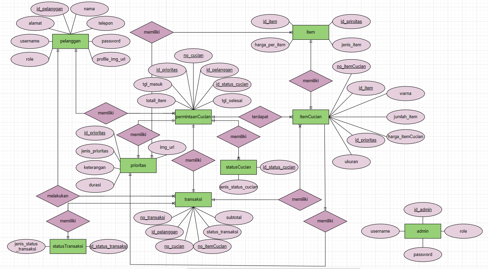
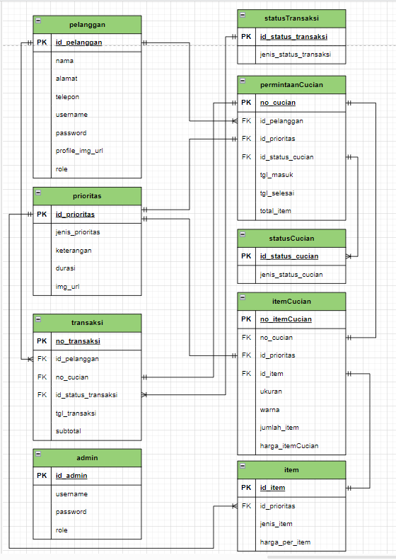

  <h2 align="center">
    Aplikasi Pencatatan Laundry
  </h2>

<!-- Daftar Isi -->

  
<h2 style="display: inline-block">Daftar Isi</h2>

  <ol>
    <li><a href="#anggota-tim">Anggota Tim</a></li>
    <li><a href="#deskripsi">Deskripsi</a></li>
    <li><a href="#latar-belakang">Latar Belakang</a></li>
    <li><a href="#tujuan-dan-manfaat">Tujuan dan Manfaat</a></li>
    <li><a href="#erd-dan-tabel-relasi">ERD dan Tabel Relasi</a></li>
    <li><a href="#mockup">Mockup</a></li>
    <li><a href="#bahasa-dan-software-yang-digunakan">Bahasa dan Software yang Digunakan</a></li>
  </ol>

<!-- Anggota Tim -->
## Anggota Tim
| NPM           | Name            |
| ------------- |-----------------|
| 140810220020  | Nurkahfi A R    |
| 140810220026  | M Rumi Rifai    |
| 140810220036  | Alif Al Husaini |

<!-- Deskripsi -->
## Deskripsi

Aplikasi Catatan Laundry merupakan sebuah aplikasi berbasis web yang menjadi penghubung antara perusahaan laundry dengan para pelanggan. Lewat aplikasi ini, para pelanggan bisa membuat permintaan jasa untuk cuci pakaian mereka. Di aplikasi ini, para pelanggan juga bisa dengan mudah memisahkan dan memilah pakaian mereka lewat menu item nantinya. Aplikasi ini juga menyediakan fitur transaksi sehingga para pelanggan bisa melakukan pembayaran dimanapun dan kapanpun

<!-- Latar Belakang -->
## Latar Belakang

Pakaian merupakan salah satu kebutuhan primer bagi manusia. Pakaian melindungi manusia dari berbagai faktor eksternal entah itu cuaca, lingkungan sekitar, dan lain sebagainya. Setiap orang tentu menginginkan pakaian mereka selalu bersih dan rapih, tetapi sayangnya, terkadang tidak semua orang punya waktu untuk mengurus dan menyiapkan pakaian mereka sendiri.

Laundry merupakan sebuah solusi dari permasalahan tersebut. Laundry menyediakan jasa untuk membersihkan, mengurus, serta merapikan pakaian pelanggannya. Sayangnya, tidak semua bisnis laundry berjalan secara efisien. Membeludaknya permintaan membuat para pekerja kewalahan dan terkadang sampai melakukan kesalahan fatal seperti tertukarnya pakaian antar pelanggan atau bahkan hilangnya pakaian pelanggan.

Untuk mengatasi masalah tersebut, hadirlah aplikasi pencatatan laundry yang dimana membantu para pekerja bisa dengan mudah mengatur permintaan setiap pelanggan secara terstruktur dan efisien. Bukan hanya para pekerja, dengan adanya aplikasi ini, para pelanggan dimudahkan dari segi membuat permintaan, pemilahan item, serta pembayaran.

<!-- Tujuan dan Manfaat -->
## Tujuan dan Manfaat

Seperti yang dijelaskan pada bagian sebelumnya, tujuan dibuatnya aplikasi ini adalah membantu para pekerja jasa laundry dengan mudah mengatur berbagai macam permintaan yang masuk sehingga berbagai proses pengerjaan yang terjadi tidak mengalami kesalahan yang berarti dan bekerja secara efisien.

Beberapa manfaat didapat dari aplikasi ini adalah :
* Memudahkan pencatatan permintaan yang masuk
* Memudahkan pengolahan permintaan laundry
* Memudahkan pelanggan membuat permintaan
* Memudahkan pelanggan dalam hal pembayaran

<!-- ERD dan Tabel Relasi -->
## ERD dan Tabel Relasi

Berikut Entity Relationship Diagram dari aplikasi pencatatan laundry yang kami buat
  
Berikut Tabel Relasi dari aplikasi pencatatan laundry yang kami buat
  

<!-- Mockup -->
## Mockup

TBA

<!-- Bahasa dan Software yang digunakan -->
## Bahasa dan Software yang Digunakan

Untuk bahasa dan software yang kami gunakan antara lain:
* MySQL untuk membuat database sistem
* PHP untuk membuat sistem CRUD
* HTML untuk membuat struktur web
* CSS untuk membuat tampilan web
